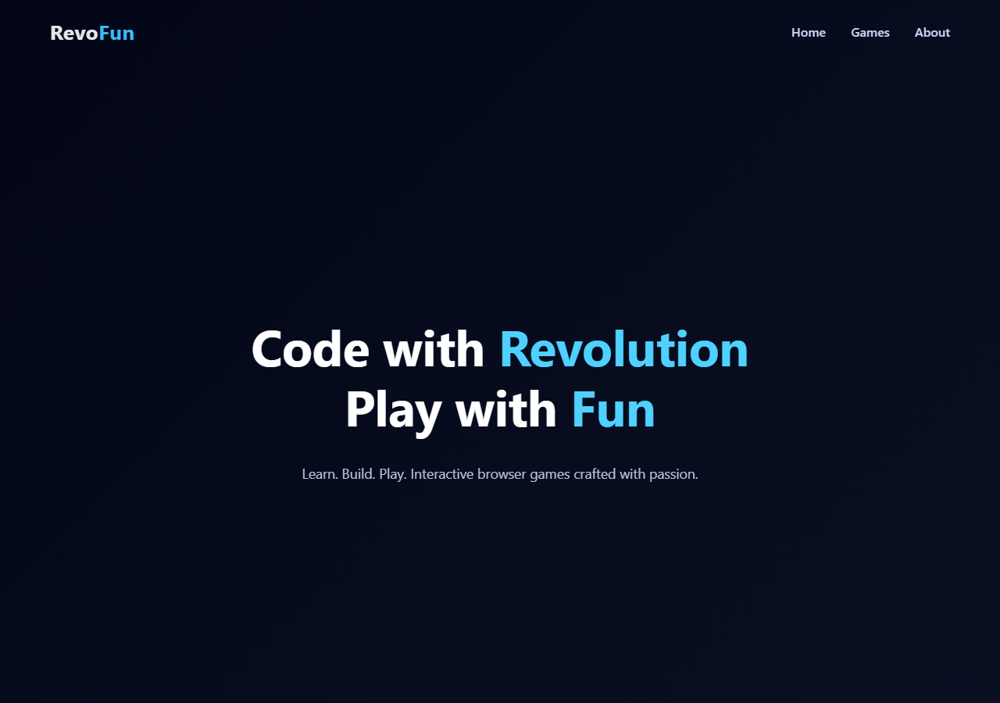

[](https://classroom.github.com/a/PAiQDgnZ)

# RevoFun — Interactive Gaming Website

**Author:** Rachmat Febrian  
**License:** [MIT](LICENSE)  
**Live demo:** https://revou-fsse-oct25.github.io/milestone-2-febrianrachmat/



## Overview

RevoFun is a fictional gaming company website created as part of Milestone 2 Assignment.
This project showcases a landing page and multiple browser-based mini games built with HTML, CSS, and JavaScript.

The goal is to demonstrate fundamental JavaScript skills, DOM manipulation, and basic game logic while delivering an engaging, user-friendly experience.

## Features

### Landing Page
- Clean, game studio–style design with fixed navigation
- Games showcase with visual previews
- About section and portfolio-ready meta tags (description, Open Graph, favicon)

### Available Games

| Game | Description |
|------|-------------|
| **Number Guess** | Guess a number between 1–100 with 5 attempts |
| **Rock Paper Scissors** | Classic hand game vs computer with win streak leaderboard |
| **Clicker Game** | Click as fast as possible within a 10-second timer |
| **Memory Card** | Match 4 pairs of cards with as few moves as possible |
| **Avoid Falling Objects** | Dodge falling blocks using keyboard or on-screen controls |

### Shared Features
- Player nickname (optional, saved in `localStorage`)
- Per-game leaderboard (top 5 scores via shared `utils.js`)
- Win/lose CSS animations (class toggle, no external library)
- Responsive layout and accessibility improvements (labels, focus rings, ARIA)

## Technologies Used

- **HTML5** — structure and semantics
- **CSS3** — layout, animations, responsive design
- **JavaScript** — game logic, DOM manipulation, event handling
- **localStorage** — nickname and leaderboard persistence

## Project Structure

```
revofun/
│
├── index.html
├── LICENSE
├── Assets/
│   ├── Clicker.png
│   ├── GuessNumber.png
│   ├── RockPaperScissor.png
│   ├── MemoryCard.svg
│   ├── AvoidFalling.svg
│   ├── favicon.svg
│   └── screenshot.png
├── CSS/
│   ├── style.css
│   ├── outcomes.css
│   ├── clicker.css
│   ├── number-guess.css
│   ├── rps.css
│   ├── memory-card.css
│   └── avoid-falling.css
├── Games/
│   ├── number-guess.html
│   ├── rps.html
│   ├── clicker.html
│   ├── memory-card.html
│   └── avoid-falling.html
├── JS/
│   ├── main.js
│   ├── utils.js
│   ├── number-guess.js
│   ├── rps.js
│   ├── clicker.js
│   ├── memory-card.js
│   └── avoid-falling.js
└── README.md
```

Paths are **case-sensitive** on GitHub Pages (Linux). Use `Assets/`, `CSS/`, `Games/`, and `JS/` exactly as shown above and in `index.html`.

## Getting Started

1. Clone this repository
2. Open `index.html` in a browser (or visit the live demo URL above)
3. No build step or dependencies required

## Learning Outcomes

Through this project, I practiced:

- Writing clean and structured HTML
- Styling layouts with modern CSS
- Using JavaScript for game logic and DOM updates
- Handling user events (click, input, keyboard)
- Persisting data with `localStorage`
- Organizing files for a small multi-page web project
- Reusing shared logic (`utils.js`) across game scripts

---

© 2025 Rachmat Febrian · [MIT License](LICENSE)

This project was created as a learning assignment for Revou FSSE.
All code was written manually to ensure understanding of core web development concepts.
