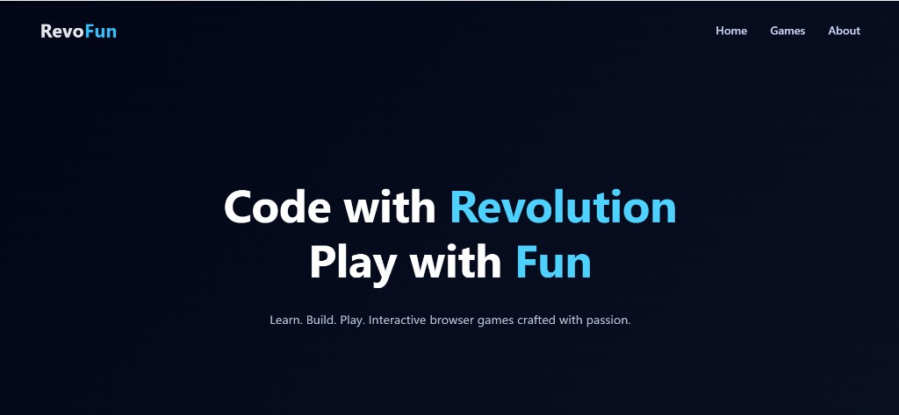
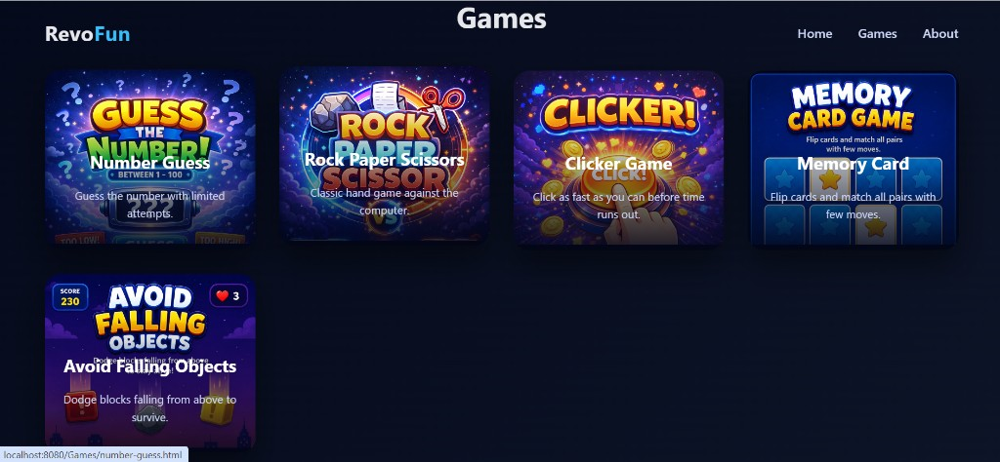
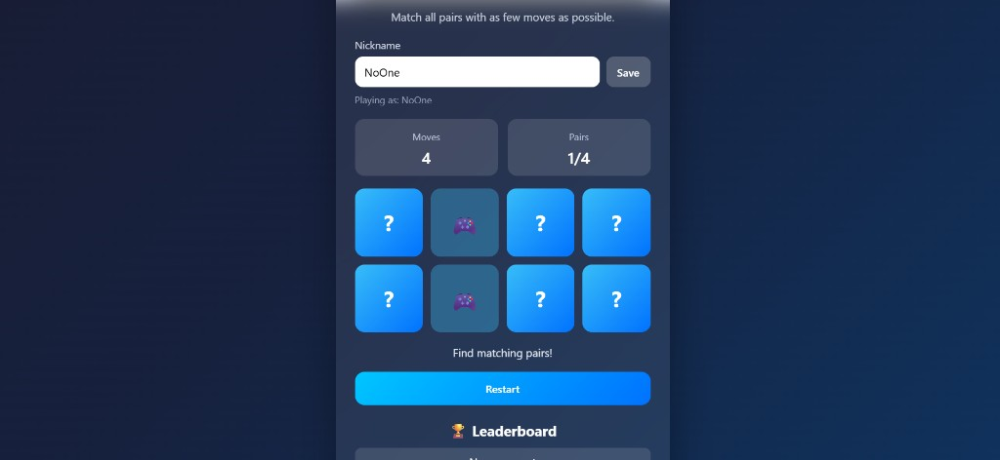
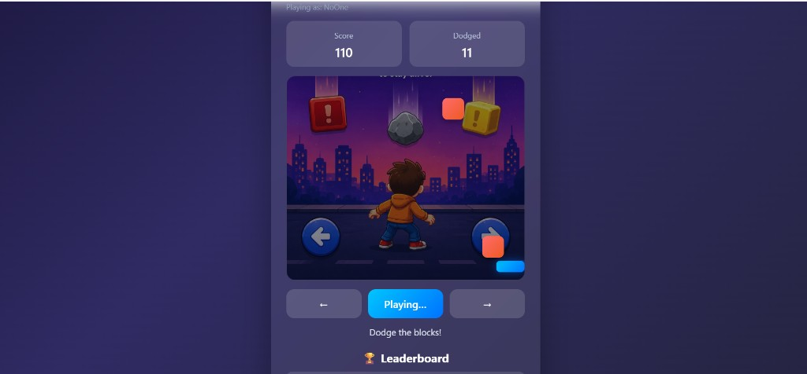

[](https://classroom.github.com/a/PAiQDgnZ)

# RevoFun — Interactive Gaming Website

**Author:** Rachmat Febrian · **License:** [MIT](LICENSE)

RevoFun is a fictional game studio website built for Milestone 2 (Revou FSSE). It combines a portfolio-style landing page with browser-based mini games written in vanilla HTML, CSS, and JavaScript — no frameworks or build tools required.

## Live Demo

**[https://revou-fsse-oct25.github.io/milestone-2-febrianrachmat/](https://revou-fsse-oct25.github.io/milestone-2-febrianrachmat/)**

## Screenshots

**Home (hero section)**



**Games showcase**



**Memory Card (gameplay — nickname, board, leaderboard)**



**Avoid Falling Objects (gameplay — score, arena, controls)**



## Features

### Landing Page
- Fixed navigation with smooth scroll to Home, Games, and About
- Games showcase grid with preview images
- About section, favicon, meta description, and Open Graph tags for portfolio sharing

### Core Games (3 required)

| Game | Highlights |
|------|------------|
| **Number Guess** | Guess 1–100 in 5 attempts; feedback for too high / too low |
| **Rock Paper Scissors** | Player vs CPU; win streak saved on Restart |
| **Clicker Game** | 3-2-1 countdown, then click as fast as possible in 10 seconds |

### Player Nickname
- Optional nickname on every game page
- Saved in `localStorage` and shown as **Playing as: …**
- Guest reminder when a score is saved without a saved nickname

### Leaderboard
- Top 5 scores per game, stored in `localStorage`
- Shared helpers in `JS/utils.js` (`saveScore`, `getScores`, `clearLeaderboard`)
- Clear leaderboard button on each game (demo / reset)

### Bonus Games (stretch)
- **Memory Card** — match 4 pairs; score based on moves
- **Avoid Falling Objects** — dodge falling blocks with keyboard or on-screen controls

## Tech Stack

- **HTML5** — semantic structure and game pages
- **CSS3** — layout, glass-style cards, flip animations, win/lose effects
- **JavaScript (ES6+)** — game logic, DOM updates, event handling
- **localStorage** — nickname and leaderboard persistence

## Project Structure

```
milestone-2-febrianrachmat/
│
├── index.html
├── LICENSE
├── Assets/
│   ├── Clicker.png
│   ├── GuessNumber.png
│   ├── RockPaperScissor.png
│   ├── MemoryCard.png
│   ├── AvoidFalling.png
│   ├── favicon.svg
│   ├── screenshot.png
│   ├── screenshot-home.png
│   ├── screenshot-games.png
│   ├── screenshot-memory.png
│   └── screenshot-avoid-falling.png
├── CSS/
│   ├── style.css
│   ├── outcomes.css
│   ├── number-guess.css
│   ├── rps.css
│   ├── clicker.css
│   ├── memory-card.css
│   └── avoid-falling.css
├── Games/
│   ├── number-guess.html
│   ├── rps.html
│   ├── clicker.html
│   ├── memory-card.html
│   └── avoid-falling.html
├── JS/
│   ├── main.js
│   ├── utils.js
│   ├── number-guess.js
│   ├── rps.js
│   ├── clicker.js
│   ├── memory-card.js
│   └── avoid-falling.js
└── README.md
```

> Paths are **case-sensitive** on GitHub Pages. Use `Assets/`, `CSS/`, `Games/`, and `JS/` exactly as in `index.html`.

## How to Run Locally

1. Clone the repository:
   ```bash
   git clone https://github.com/Revou-FSSE-Oct25/milestone-2-febrianrachmat.git
   cd milestone-2-febrianrachmat
   ```
2. Open `index.html` in a browser, **or** serve the folder:
   ```bash
   npx serve .
   ```
3. Visit `http://localhost:3000` (or the port shown in the terminal).

No install or build step is required.

## Learning Outcomes

- Structured multi-page HTML and reusable CSS patterns
- DOM manipulation and event-driven game logic in plain JavaScript
- Input validation, timers, and collision-style gameplay
- Persisting nickname and leaderboard data with `localStorage`
- Shared utilities (`utils.js`) instead of duplicating code per game
- Basic accessibility: labels, focus rings, `aria-live`, and `aria-label`

## Challenges & What I Learned

- **Case-sensitive paths** — GitHub Pages (Linux) broke assets when folder names did not match exactly (`Assets/` vs `assets/`).
- **RPS scoring UX** — wins only save on Restart; added an on-screen hint so players know when scores hit the leaderboard.
- **Shared state** — centralizing nickname and leaderboard in `utils.js` kept all five games consistent with less duplication.
- **Stretch scope** — adding Memory Card and Avoid Falling Objects pushed me to plan grid layouts, flip animations, and a simple game loop with `requestAnimationFrame`.

---

© 2025 Rachmat Febrian · [MIT License](LICENSE)

Built as a learning assignment for Revou FSSE. All code was written manually to practice core web fundamentals.
